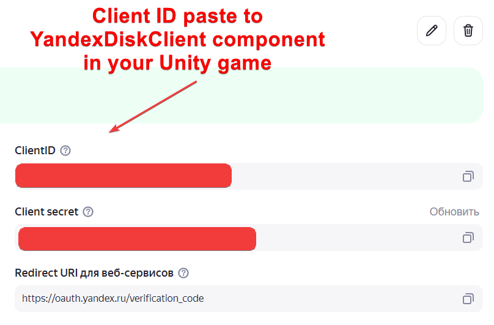
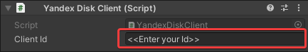
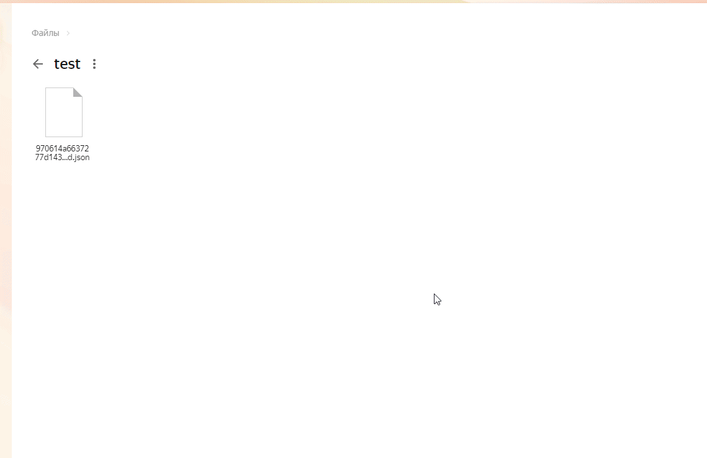

# Yandex Disk Plugin for Unity

Yandex Disk plugin is an open source plugin whose goal is to provide the developer with a simple interaction with the Yandex.Disk API to integrate it into the game in Unity. However, not all API requests have been implemented yet, but they are still at the development stage.

## Overview

The plugin provides support for the features of the Yandex Disk API such as:

- authorization
- creating folder
- getting disk and person information
- getting files of folder
- getting information about folder
- downloading/uploading files to folder

##Requirements:

To install `YandexDiskSDK`, you need: 

- Unity 2021.3 LTS (maybe the plugin works in earlier versions like 2019 or 2020, but I haven't checked)
- Newtonsoft.Json

As of Unity3D 2021.3 LTS, here is a chart of platform support

| Platform                            | Is `YandexDiskSDK` supported?          |
|-------------------------------------|----------------------------------------|
| Android (IL2CPP)                    | Yes                                    |
| Android (Mono)                      | Yes                                    |
| iOS (IL2CPP)                        | Not tested                             |
| PlayStation 4 (IL2CPP)              | No                                     |
| PlayStation Vita (IL2CPP)           | No                                     |
| Standalone (IL2CPP)                 | Yes (tested only Windows)              |
| Standalone (Mono)                   | Yes (tested only Windows)              |
| Universal Windows Platform (IL2CPP) | Not tested                             |
| Universal Windows Platform (.NET)   | Not tested                             |
| WebGL (IL2CPP)                      | No (it will be later)                  |
| WiiU (Mono)                         | No                                     |
| XBox One (IL2CPP)                   | No                                     |

## Install Yandex Disk Plugin

Open `Package Manager` (Window --> Package Manager) and choose `Add package from git URL...` Paste this git repository and this is the finish. 

**WARNING!!** If you decide to export `Main Sample`, please note that the correct operation of the functions will be carried out only in editor mode.

## Configure Your Application

To use the plugin, you must first [create and configure application](https://yandex.ru/dev/oauth/) in the [Yandex OAuth](https://oauth.yandex.ru/client/new/id/). After creating yandex application, you see Client ID in your application.



Create empty game object in scene and add component [YandexDiskClient](https://github.com/Roofikk/yandex-disk-sdk/blob/master/Runtime/YandexDisk/YandexDiskClient.cs). Paste Client ID from yandex application in component's field.



## Authorization

For beginning need open authorization page in browser.

```csharp

    using YandexDiskSDK;
    using UnityEngine;
    
    [SerializeField] private YandexDiskClient _diskClient;
    
    private void Start()
    {
        string redirectUri = "https://oauth.yandex.ru/verification_code";
        _diskClient.OpenAuthorizationPage(redirectUri);
    }

```

To use functions of Yandex Disk need authorization with token.

```csharp

    using YandexDiskSDK;
    using UnityEngine;
    
    [SerializeField] private YandexDiskClient _diskClient;
    
    private void Start()
    {
        string token = "Your token after open authorization page";
        _diskClient.Authorize(token).RunAsyncOnMainThread((person) => {
            if (person == null)
            {
                //Authorization failed
                return;
            }
            
            Debug.Log($"Authorization success. Welcome, {person.FirstName} {person.LastName}");
        });
    }
    
```

You can also use `RunAsync(() => {})`, but Unity may work incorrectly. Some elements and game functions run on the main thread. Therefore, async methods will not always work well, use `RunAsyncOnMainThread(() => {})` for this.

## Upload and download files

### Upload file to Yandex disk

```csharp

    string sourcesPathFile = @"D:\test\text.txt";
    string targetFolder = "disk:/test";

    _diskClient.UploadFile(sourcesPathFile, targetFolder, true).RunAsyncOnMainThread((fileInfo) =>
    {
        if (fileInfo.Status == ResponseStatus.Success)
        {
            Debug.Log("File has been uploaded success");
            Debug.Log($"File uploaded from {fileInfo.SourcePath} to {fileInfo.TargetPath}");
        }
    });

```

    
Also you may use ` YandexDiskClient.UploadFiles(string[] source, string target, overwrite = true) ` to upload some files.

### Download file from Yandex disk

```csharp

    string sourcesPathFile = "disk:/test/test.txt";
    string targetFolder = @"D:\download test\";

    _diskClient.DownloadFile(sourcesPathFile, targetFolder, true).RunAsyncOnMainThread((fileInfo) =>
    {
        if (fileInfo.Status == ResponseStatus.Success)
        {
            Debug.Log("File has been download success");
            Debug.Log($"File downloaded from {fileInfo.SourcePath} to {fileInfo.TargetPath}");
        }
    });

```



Also you may use ` YandexDiskClient.DownloadFiles(string[] source, string target, overwrite = true) ` to download some files.
